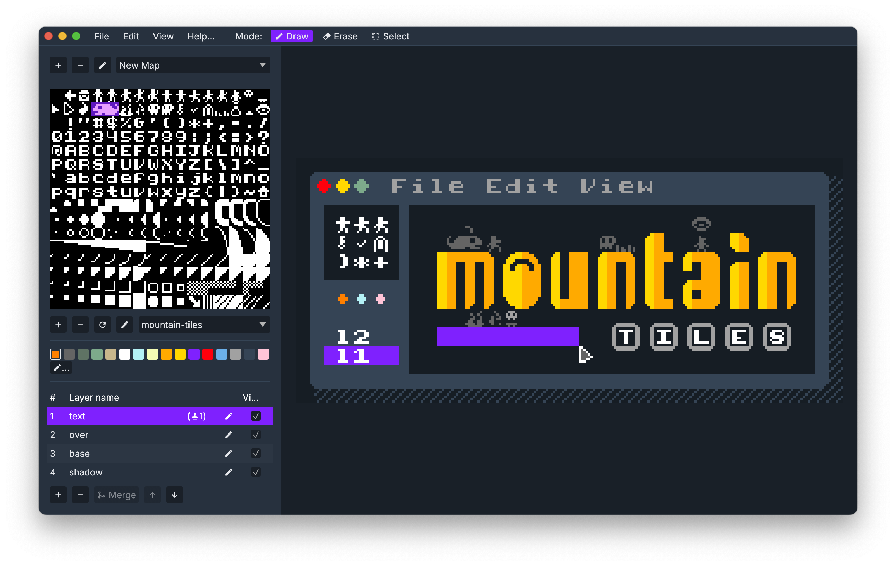
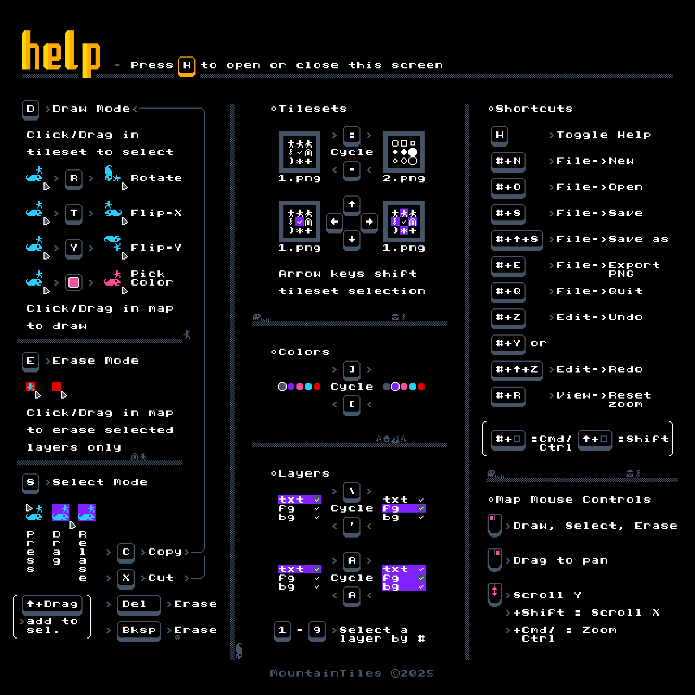

# MountainTiles

A tile-based map/image editor using [egui](https://www.egui.rs), coded by humans without AI.

<!-- markdownlint-disable MD033 -->

<!-- markdownlint-enable MD033 -->

Note that this project is developed on [Codeberg](https://codeberg.org/mountainlizard/mountain-tiles) and mirrored to [Github](https://github.com/mountainlizard/mountain-tiles). Please use the [Codeberg repo](https://codeberg.org/mountainlizard/mountain-tiles) for [issues](https://codeberg.org/mountainlizard/mountain-tiles/issues), [pull requests](https://codeberg.org/mountainlizard/mountain-tiles/pulls) etc. since the Github repo is just a mirror.

Please see [`CONTRIBUTING.md`](CONTRIBUTING.md) if you wish to contribute to the project, there are also notes on the [development](development.md) process.

## Downloads

Installers are available on the [Github releases page](https://github.com/mountainlizard/mountain-tiles/releases).
The macOS builds are signed and notarized so should run without additional permissions/settings.

The following platforms are supported (see notes for support level) - the last part of the filename indicates the platform:

| Platform                         | File ends with:    | Notes                      |
| -------------------------------- | ------------------ | -------------------------- |
| macOS - Apple Silicon            | \_aarch64.dmg      | Tested                     |
| macOS - Intel                    | \_x64.dmg          | Tested (on M1 via Rosetta) |
| Linux - Intel/AMD (.deb package) | \_amd64.deb        | Tested                     |
| Linux - ARM 64 (.deb package)    | \_arm64.deb        | Tested                     |
| Linux - Intel/AMD (AppImage)     | \_x86_64.AppImage  | Tested                     |
| Linux - ARM 64 (AppImage)        | \_aarch64.AppImage | Tested                     |
| Linux - Intel/AMD (archive)      | \_x86_64.tar.gz    | Tested                     |
| Linux - ARM 64 (archive)         | \_aarch64.tar.gz   | Tested                     |
| Windows - Intel (Installer)      | \_x64-setup.exe    | Tested                     |
| Windows - ARM 64 (Installer)     | \_arm64-setup.exe  | Untested                   |
| Windows - Intel (Executable)     | \_X64.exe          | Tested                     |
| Windows - ARM 64 (Executable)    | \_ARM64.exe        | Untested                   |

Let me know if you try it out on Windows ARM64 - I'd be interested to know if it works, I don't have a device to test on.

Note that in theory other unixes may work, however this might require disabling the logic for running a single instance of the application only. In addition, the `interprocess` crate will use file-type sockets on this platform, and warns about possible issues with stale files. It may be possible to mitigate this issue by allowing for deleting stale files, but this would require more investigation. If anyone tries, please let me know how it goes.

## Example Files

Check the example-data folder in this repo for example files, including the map shown in the screenshot above, and the instructions for the software as a map!

## Features

Mountain Tiles was created to quickly and easily edit maps where each tile can be tinted using a palette, and rotated/mirrored. This is particularly useful for lower res and 1-bit tiles, but it's possible to use high res tiles in color with alpha.

- Support for macOS, Linux and Windows.
- Multiple maps per project, sharing the same tilesets and palette.
- Multiple layers per map.
- Each tile has a tint color chosen from the palette (using white leaves tile untinted).
- Copy and paste between layers and maps.
- Support for tilesets with alpha, or with a transparent color (can be configured on import).
- Support for arbitrary-sized palette, with optional alpha values.
- Select and draw with one or more tiles from the tileset, or copied from the map.
- Rotate and mirror tiles.
- Import/export maps in [Tiled](http://www.mapeditor.org) format.
- Import/export palettes in [lospec](https://lospec.com) JSON format, and as PNG images.
- Export maps as PNG images with/without transparent background.

You can press "h" or click the "Help..." menu item to show common shortcuts and actions in the app - this will show something like the following:

<!-- markdownlint-disable MD033 -->

<!-- markdownlint-enable MD033 -->

## Alternatives

There are much more mature alternative map editors that have a much deeper feature set, particularly for use with games, but at least for now each one is missing some of the features of Mountain Tiles, so that they don't allow for tiles to be rotated, mirrored and tinted using a palette:

1. [Tiled](http://www.mapeditor.org) is an excellent, full-featured map editor, however it doesn't seem to have an easy workflow for tinting individual tiles using a palette. The closest workflow I could find was to have one layer per color, and move tiles around between layers to change color. This is also the approach Mountain Tiles uses to export to Tiled format - each combination of a layer and color in Mountain Tiles is exported as its own tinted layer in Tiled.

2. [LDtk](https://ldtk.io) is another great editor, however it doesn't support rotating tiles (although there is an [issue to support this](https://github.com/deepnight/ldtk/issues/207)).

3. [REXPaint](https://www.gridsagegames.com/rexpaint/) is a really beautiful editor, but only supports Windows natively, and doesn't support tile rotation or mirroring.

4. [Sprite Fusion](https://www.spritefusion.com) supports tile rotation and mirroring, but doesn't seem to support setting individual tile colors using a palette.

If you know of a cross-platform editor that supports tile rotation, mirroring and tinting with a palette, please let me know!

## Additional information

There are additional docs covering:

- [Development](development.md)
- [Running in a browser](web-platform.md)
- [CI and packaging](ci-and-packaging.md)
- [macOS signing and notarization](macos-signing.md)
- [Contributing to the project](CONTRIBUTING.md)
