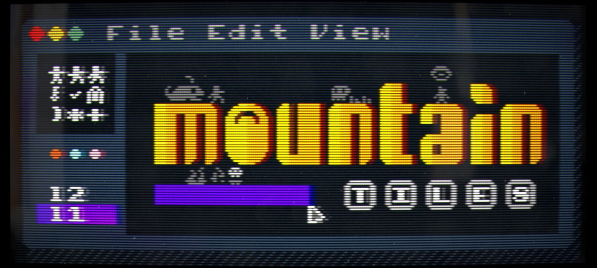

# MountainTiles



A tile based map/image editor using egui.

This project was created using the [eframe template](https://github.com/emilk/eframe_template/)

Please see `CONTRIBUTING.md` if you wish to contribute to the project.

## Running locally

Make sure you are using the latest version of stable rust by running `rustup update`.

On Linux you need to first run:

`sudo apt-get install libxcb-render0-dev libxcb-shape0-dev libxcb-xfixes0-dev libxkbcommon-dev libssl-dev`

On Fedora Rawhide you need to run:

`dnf install clang clang-devel clang-tools-extra libxkbcommon-devel pkg-config openssl-devel libxcb-devel gtk3-devel atk fontconfig-devel`

To run directly:

```bash
cargo run --release
```

To watch for changes and kill then restart application, install [bacon](https://dystroy.org/bacon/) and then run:

```bash
bacon run
```

## Packaging

Packages are built using [cargo-packager](https://github.com/crabnebula-dev/cargo-packager).

Install this using:

```bash
cargo install cargo-packager --locked
```

You can then package for your current platform using:

```bash
cargo packager --release
```

If packaging on macOS, this may fail if you have the `.dmg` file created by a previous build still mounted - unmount it and run again.

To sign and notarise the application bundle on macOS, see [Signing on macOS](macos-signing.md).

Packaging has been tested as:

1. `.app` and `.dmg` on macOS (Arm64 on M1, x64 tested only via cross compile then Rosetta on M1)
2. `.deb`, `.tar.gz` and `.AppImage` on Linux (pop_os on Intel, Raspberry Pi OS (KDE) on arm64)
3. `.exe` installer on Windows (Intel)

## Supported platforms

The goal is to support the following:

1. macOS with Apple Silicon. This should work on Intel, but is only tested with cross-compile and Rosetta on Apple Silicon, I don't have an Intel mac to test with.
2. Windows on Intel. If anyone wants to try Arm let me know how it goes, I don't have a device to test with.
3. Linux on Arm64 (tested on Raspberry Pi 5) and Intel.

Note that in theory other unixes may work, however this might require disabling the logic for running a single instance of the application only. In addition, the `interprocess` crate will use file-type sockets on this platform, and warns about possible issues with stale files. It may be possible to mitigate this issue by allowing for deleting stale files, but this would require more investigation. If anyone tries, please let me know how it goes.

## Running web version locally

Note that the web version is currently incomplete - it's missing functionality to open maps and tilesets without the filesystem. As a result, it won't currently compile. This may be addressed in future, e.g. by allowing use of local storage.

You can compile to [WASM](https://en.wikipedia.org/wiki/WebAssembly) and publish it as a web page.

We use [Trunk](https://trunkrs.dev/) to build for web target.

1. Install the required target with `rustup target add wasm32-unknown-unknown`.
2. Install Trunk with `cargo install --locked trunk`.
3. Run `trunk serve` to build and serve on `http://127.0.0.1:8080`. Trunk will rebuild automatically if you edit the project.
4. Open `http://127.0.0.1:8080/index.html#dev` in a browser. See the warning below.

> `assets/sw.js` script will try to cache our app, and loads the cached version when it cannot connect to server allowing your app to work offline (like PWA).
> appending `#dev` to `index.html` will skip this caching, allowing us to load the latest builds during development.

## Deploying web version

1. Just run `trunk build --release`.
2. It will generate a `dist` directory as a "static html" website
3. Upload the `dist` directory to any of the numerous free hosting websites including [GitHub Pages](https://docs.github.com/en/free-pro-team@latest/github/working-with-github-pages/configuring-a-publishing-source-for-your-github-pages-site).
4. we already provide a workflow that auto-deploys our app to GitHub pages if you enable it.
   > To enable Github Pages, you need to go to Repository -> Settings -> Pages -> Source -> set to `gh-pages` branch and `/` (root).
   >
   > If `gh-pages` is not available in `Source`, just create and push a branch called `gh-pages` and it should be available.
   >
   > If you renamed the `main` branch to something else (say you re-initialized the repository with `master` as the initial branch), be sure to edit the github workflows `.github/workflows/pages.yml` file to reflect the change
   >
   > ```yml
   > on:
   >   push:
   >     branches:
   >       - <branch name>
   > ```

## Continuous integration

For the most part, the CI set up in github actions should just run, however it does expect to have various secrets set up for Apple signing/notarization. See the [github actions howto](https://docs.github.com/en/actions/how-tos/deploy/deploy-to-third-party-platforms/sign-xcode-applications) for the required secrets - see `rust.yml` in the github workflows for details.

- `BUILD_CERTIFICATE_BASE64` contains base64-encoded .p12 for an Apple Signing Certificate.
- `P12_PASSWORD` contain the password for the .p12 file.
- `KEYCHAIN_PASSWORD` a random string used as the keychain password for the keychain created on the agent as part of build.

We've omitted the following secrets from the how-to, since we don't build mobile versions:

- `BUILD_PROVISION_PROFILE_BASE64` contains base64-encoded provisioning profile.

Note that if the name of the developer changes, the `signing-identity` in `Cargo.toml` will need to be updated - this should be the name of the certificate in the .p12 file stored as a secret.

In order to perform a release, you also need:

- `RELEASE_TOKEN` contains a github personal access token with permissions to read and write contents, this is used to create a release and attach assets.

## References

- [Helpful guide on signing and notarizing on macOS](https://scriptingosx.com/2021/07/notarize-a-command-line-tool-with-notarytool/)
