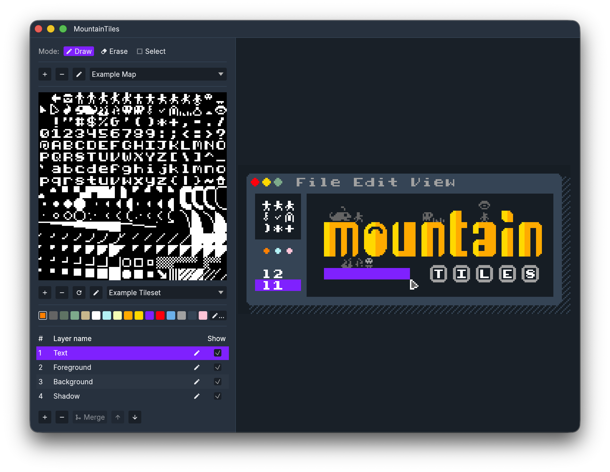
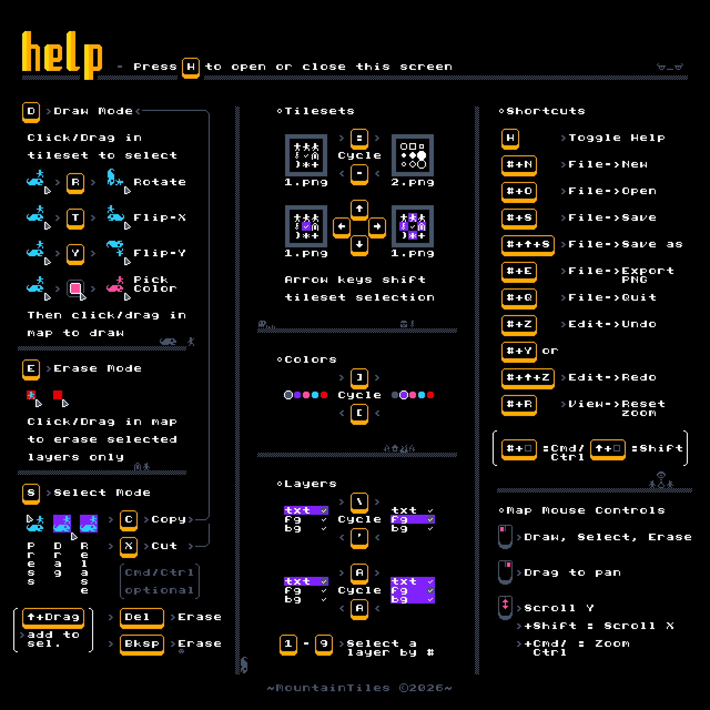

# MountainTiles

A tile-based map/image editor using [`egui`](https://www.egui.rs), coded by humans without AI.

<!-- markdownlint-disable MD033 -->

<!-- markdownlint-enable MD033 -->

Note that this project is developed on [Codeberg](https://codeberg.org/mountainlizard/mountain-tiles), please use this project for issues, pull requests etc. There is a mirror on GitHub but this is only used for [building releases](https://github.com/mountainlizard/mountain-tiles/releases).

Please see [`CONTRIBUTING.md`](CONTRIBUTING.md) if you wish to contribute to the project, there are also notes on the [development](development.md) process.

## Features

Mountain Tiles was created to quickly and easily edit maps where each tile can be tinted using a palette, and rotated/mirrored. This is particularly useful for lower res and 1-bit tiles, but it's possible to use high res tiles in color with alpha.

- Support for macOS, Linux and Windows.
- Multiple maps per project, sharing the same tilesets and palette.
- Multiple layers per map.
- Each tile has a tint color chosen from the palette (using white leaves tile untinted).
- Copy and paste between layers and maps.
- Support for tilesets with alpha, or with a transparent color (can be configured on import).
- Support for arbitrary-sized palette, with optional alpha values.
- Select and draw with one or more tiles from the tileset, or copied from the map.
- Rotate and mirror tiles.
- Import/export maps in [Tiled](http://www.mapeditor.org) format.
- Import/export palettes in [`lospec`](https://lospec.com) JSON format, and as PNG images.
- Export maps as PNG images with/without transparent background.
- Uses a simple file layout - one `.mnp` file contains a project with multiple maps. This links to image files for tilesets, using absolute or relative paths. An optional `.toml` file can be used to allow exporting maps and other data with customized settings and targets.
- A small, self-contained application that starts and runs quickly even on low-end hardware, e.g. Raspberry Pi. (`egui` renders using accelerated graphics, without needing Electron or a web-view).

You can press "h" or click the "Help…" menu item to show common shortcuts and actions in the app - this will show something like the following:

<!-- markdownlint-disable MD033 -->

<!-- markdownlint-enable MD033 -->

## Downloads

Installers are available on the [GitHub releases page](https://github.com/mountainlizard/mountain-tiles/releases).
The macOS builds are signed and notarized so should run without additional permissions/settings.

The following platforms are supported (see notes for support level) - the last part of the filename indicates the platform:

| Platform                           | File ends with:    | Notes                      |
| ---------------------------------- | ------------------ | -------------------------- |
| macOS - Apple Silicon              | `aarch64.dmg`      | Tested                     |
| macOS - Intel                      | `x64.dmg`          | Tested (on M1 via Rosetta) |
| Linux - Intel/AMD (`.deb` package) | `amd64.deb`        | Tested                     |
| Linux - ARM 64 (`.deb` package)    | `arm64.deb`        | Tested                     |
| Linux - Intel/AMD (AppImage)       | `x86_64.AppImage`  | Tested                     |
| Linux - ARM 64 (AppImage)          | `aarch64.AppImage` | Tested                     |
| Linux - Intel/AMD (archive)        | `x86_64.tar.gz`    | Tested                     |
| Linux - ARM 64 (archive)           | `aarch64.tar.gz`   | Tested                     |
| Windows - Intel (Installer)        | `x64-setup.exe`    | Tested                     |
| Windows - ARM 64 (Installer)       | `arm64-setup.exe`  | Untested                   |
| Windows - Intel (Executable)       | `X64.exe`          | Tested                     |
| Windows - ARM 64 (Executable)      | `ARM64.exe`        | Untested                   |

Let me know if you try it out on Windows ARM64 - I'd be interested to know if it works, I don't have a device to test on.

Note that in theory other Unixes may work, however this might require disabling the logic for running a single instance of the application only. In addition, the `interprocess` crate will use file-type sockets on this platform, and warns about possible issues with stale files. It may be possible to mitigate this issue by allowing for deleting stale files, but this would require more investigation. If anyone tries, please let me know how it goes.

## Example Files

Check the [example-data](https://codeberg.org/mountainlizard/mountain-tiles/src/branch/main/example-data) in this repo for example files.

1. The `.mnp` files are maps
2. The `.png` files for tilesets and palettes
3. `mountain-tiles-workspace.toml` contains workspace settings (these are optional, and configure how to export maps and other data).

If you can't see the tiles in a map, check you also downloaded the `.png` files to the same directory as the `.mnp` file. You can also edit the tileset and use the "Browse..." button to reload a tileset image if it has moved. Note that in general, tilesets don't need to be in the same directory as the map, this is just how the examples are set up.

## Alternatives

There are much more mature alternative map editors that have a much deeper feature set, particularly for use with games. At least for now each one is missing some of the features of Mountain Tiles, so that they don't allow for tiles to be rotated, mirrored and tinted using a palette:

1. [Tiled](http://www.mapeditor.org) is an excellent, full-featured map editor, however it doesn't seem to have an easy workflow for tinting individual tiles using a palette. The closest workflow I could find was to have one layer per color, and move tiles around between layers to change color. When MountainTiles exports to Tiled format it uses this approach; each combination of a layer and color in Mountain Tiles is exported as its own tinted layer in Tiled.

2. [`LDtk`](https://ldtk.io) is another great editor, however it doesn't support rotating tiles (although there is an [issue to support this](https://github.com/deepnight/ldtk/issues/207)).

3. [`REXPaint`](https://www.gridsagegames.com/rexpaint/) is a really beautiful editor, but only supports Windows natively, and doesn't support tile rotation or mirroring.

4. [Sprite Fusion](https://www.spritefusion.com) looks very good, and supports tile rotation and mirroring (as well as a web version), but doesn't seem to support setting individual tile colors using a palette.

If you know of a cross-platform editor that supports tile rotation, mirroring and tinting with a palette (or one of the options above adds these features), please let me know!

## Additional Information

There are additional docs covering:

- [Development](development.md)
- [Running in a browser](web-platform.md)
- [CI and packaging](ci-and-packaging.md)
- [macOS signing and notarization](macos-signing.md)
- [Contributing to the project](CONTRIBUTING.md)
